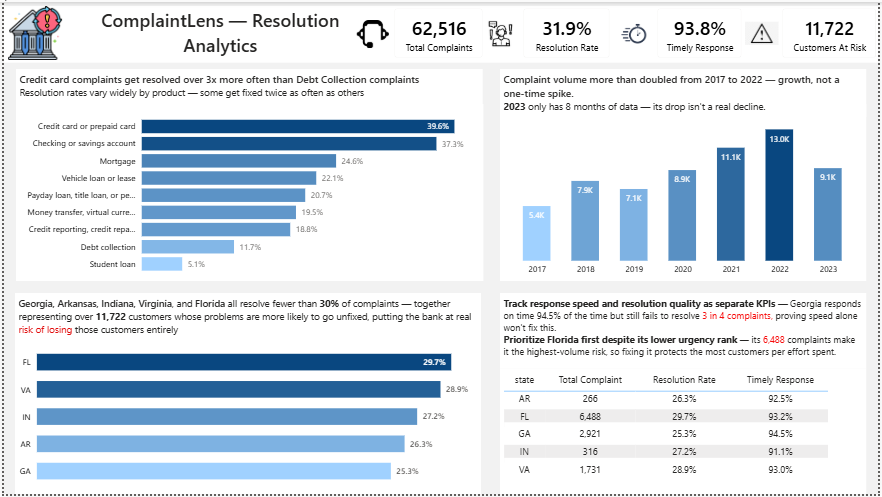

# 🏛️ ComplaintLens — Resolution Analytics

An end-to-end analysis of **62,516 financial consumer complaints**, identifying which states fail to resolve customer complaints, why, and what that means for customer churn risk — built using **PostgreSQL, SQL, and Power BI**.

---

## 📌 Project Overview

A bank receives tens of thousands of complaints a year. Not all of them get fixed. This project answers a core business question:

> **"Where are complaints going unresolved, why, and which customers are at risk of leaving because of it?"**

The analysis spans national trends, product-level resolution patterns, and a focused investigation into the five worst-performing states — culminating in a single-page Power BI dashboard built around one continuous narrative: diagnose → quantify → recommend.

---

## 🛠️ Tools & Tech Stack

| Tool | Purpose |
|---|---|
| **PostgreSQL** | Database hosting, data integrity validation, SQL-based business analysis |
| **SQL** | 15+ business queries — aggregation, window functions (`RANK()`, `LAG()`), CTEs |
| **Power BI** | Single-page interactive dashboard, DAX measures |
| **DAX** | Custom measures (Resolution Rate, Timely Response Rate, Customers At Risk) |

---

## 🗂️ Dataset

**62,516 complaint records** with 12 fields, including: `complaint_id`, `date_submitted`, `date_received`, `state`, `product`, `sub_product`, `issue`, `sub_issue`, `company_public_response`, `company_response_consumer`, `timely_response`, `submitted_via`.

**Data Integrity Checks (performed before analysis):**
| Check | Result |
|---|---|
| Row count matches source | ✅ 62,516 |
| Duplicate `complaint_id` | ✅ None found |
| `date_received` earlier than `date_submitted` | ✅ None (logically impossible, confirmed clean) |
| State codes valid | ✅ All 50 states + DC |
| Null counts (sub_product, sub_issue, etc.) | ✅ Matched expected counts from initial inspection |

---

## 🧭 Methodology Note — Defining "Resolved"

`company_response_consumer` has five possible values. For this analysis, a complaint is counted as **resolved** only if it was closed with **monetary or non-monetary relief**. "Closed with explanation" is treated as **unresolved**, since the customer's underlying problem was not actually fixed — only acknowledged. This mirrors the same reasoning applied in the LoanLens project (treating "Charged Off" as equivalent to "Default"): the goal is to measure real customer outcomes, not just case-closure status.

**Small-sample protection:** Any state-level comparison applies a minimum threshold of **200+ complaints** before being included in rankings. Several states (Alaska, Mississippi, Vermont, West Virginia) had fewer than 200 complaints and showed misleadingly extreme resolution rates as a result — they are excluded from all "worst state" comparisons to avoid drawing conclusions from statistical noise.

---

## 🔍 SQL Analysis Highlights

15+ business-driven queries were written to extract insights, including:

- Overall and per-state resolution rate, using `CASE WHEN` logic
- Timely response rate by state
- Top product per state using `RANK() OVER (PARTITION BY state ...)`
- Year-over-year complaint volume growth using `LAG()`, with integer-division bug caught and fixed via explicit `NUMERIC` casting
- National state ranking by resolution rate, filtered for minimum sample size
- Product-level resolution breakdown within a specific state (Georgia case study)

📁 Full query file: [`sql/analysis.sql`](sql/analysis.sql)

---

## 📊 Dashboard Overview



**Top row — National Context (KPIs):**
Total Complaints (62,516), Resolution Rate (31.9%), Timely Response Rate (93.8%), and Customers At Risk (11,722) — the last KPI ties the dashboard's biggest finding directly into the header, before a viewer reads any supporting text.

**Chart 1 — Resolution Rate by Product:**
*"Credit card complaints get resolved over 3x more often than Debt Collection complaints."*
Credit card (39.6%) and Checking/Savings (37.3%) resolve far more often than Debt Collection (11.7%) or Student Loan (5.1%, small sample) — showing that resolution failure isn't evenly spread across products.

**Chart 2 — Complaint Volume by Year:**
*"Complaint volume more than doubled from 2017 to 2022 — growth, not a one-time spike."*
Volume grew steadily from 5,394 (2017) to 12,953 (2022). 2023's apparent drop to 9,131 is **not a real decline** — the dataset only contains 8 months of 2023 data, making a full-year comparison misleading.

**Chart 3 / Table — The Five Worst-Resolving States:**
*"Georgia, Arkansas, Indiana, Virginia, and Florida all resolve fewer than 30% of complaints — together representing 11,722 customers whose problems are more likely to go unfixed."*

| State | Total Complaints | Resolution Rate | Timely Response |
|---|---|---|---|
| Georgia | 2,921 | 25.33% | 94.49% |
| Arkansas | 266 | 26.32% | 92.48% |
| Indiana | 316 | 27.22% | 91.14% |
| Virginia | 1,731 | 28.89% | 92.95% |
| Florida | 6,488 | 29.65% | 93.17% |

**Recommendations panel:**
1. Track response speed and resolution quality as separate KPIs — Georgia responds on time 94.5% of the time but still fails to resolve 3 in 4 complaints, proving speed alone won't fix this.
2. Prioritize Florida first despite its lower urgency rank — its 6,488 complaints make it the highest-volume risk, so fixing it protects the most customers per effort spent.

---

## 💡 Findings & Recommendations

### 1. Resolution failure is concentrated, not evenly spread — and most complaints aren't actually resolved
**Finding:** Nationally, only 31.9% of complaints are resolved with real relief. The five worst-performing states (Georgia, Arkansas, Indiana, Virginia, Florida) all sit below 30%, together accounting for 11,722 complaints.
**Action:** Focus complaint-handling resources and process review specifically on these five states rather than spreading improvement efforts evenly across all 50.
**Impact:** Concentrates limited resources where they affect the most at-risk customers, rather than diluting effort nationally.

### 2. Speed and quality are two different problems — and treating them as one hides risk
**Finding:** Georgia responds on time 94.49% of the time, yet resolves only 25.33% of complaints. Indiana, by contrast, is both slow (91.14% timely) **and** ineffective (27.22% resolved) — a compounding failure.
**Action:** Track "timely response" and "resolution rate" as two separate KPIs in internal reporting, not a single blended "customer service" score.
**Impact:** Prevents a state like Georgia — which looks fine on response speed — from being overlooked, when its real problem is resolution quality.

### 3. Florida is the highest-volume risk, even though its resolution rate looks "less severe"
**Finding:** Florida's resolution rate (29.65%) is the best of the five worst states, but its complaint volume (6,488) is more than 2x the combined total of the other four lowest-volume states.
**Action:** Prioritize Florida in remediation efforts based on absolute customer impact, not resolution-rate ranking alone.
**Impact:** Protects the largest number of actual customers per unit of effort invested — ranking by percentage alone would have deprioritized the state with the most people affected.

### 4. Resolution rate varies sharply by product — debt-related complaints fare worst
**Finding:** Credit card complaints resolve at 39.63%, while Debt Collection resolves at just 11.70% (on a meaningful sample of 2,736 complaints) — a 3.4x gap.
**Action:** Apply targeted process review to Debt Collection complaint handling specifically, rather than assuming a uniform fix will work across all products.
**Impact:** Addresses the product category most likely to be quietly dragging down overall resolution metrics.

---

## 📁 Project Structure

```
complaintlens-resolution-analytics/
│
├── dataset/
│   └── Consumer_Complaints.xlsx
├── sql/
│   └── analysis.sql
├── dashboard/
│   └── ComplaintLens_Dashboard.pbix
├── screenshots/
│   └── dashboard.png
└── README.md
```

---

## 🚀 How to Use

1. Clone this repository
2. Import `Consumer_Complaints.xlsx` into PostgreSQL (see schema in `sql/analysis.sql`)
3. Run queries in `sql/analysis.sql` to reproduce the analysis
4. Open `ComplaintLens_Dashboard.pbix` in Power BI Desktop to explore the dashboard

---

## 👤 Author

**Anas**
Data Analyst | SQL • Power BI • Python
🔗 [GitHub](https://github.com/Akhan33-10) | [LinkedIn](#)

---

⭐ If you found this project useful, consider giving it a star on GitHub!
